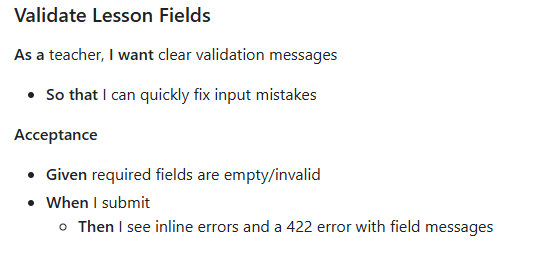
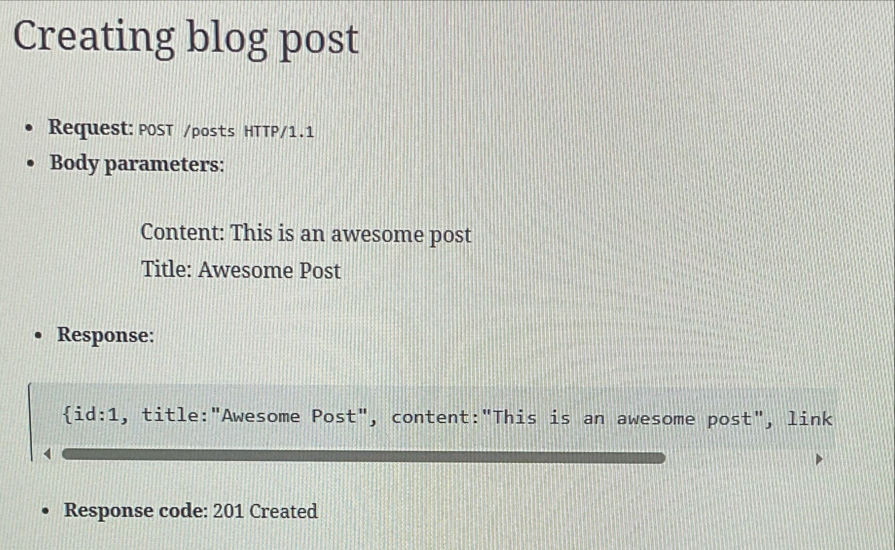
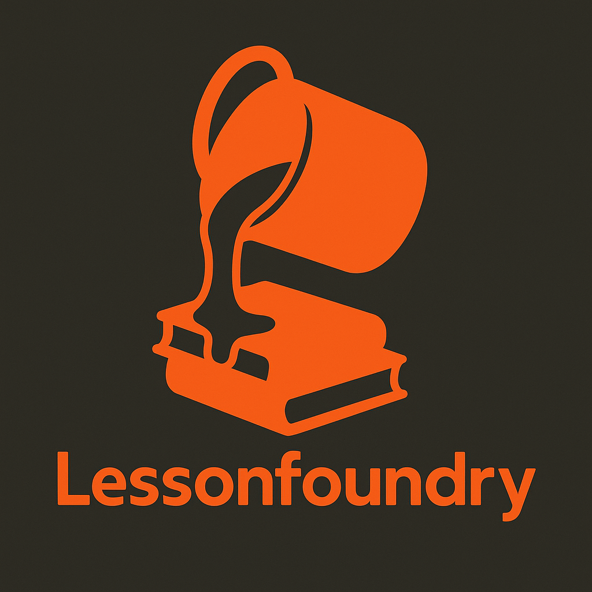
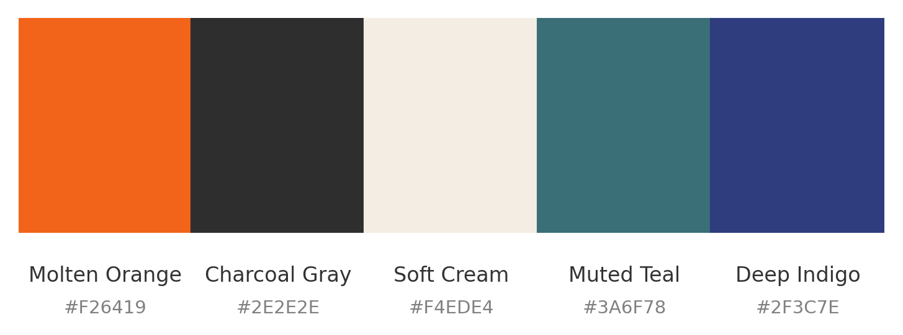

# LearningFoundry - A Lesson Planning App

## Contents
1. [Project Overview](#1-project-overview)
    - [App Overview and Context](#app-overview-and-context)
    - [Tech Stack](#tech-stack)
2. [Features](#2-features)
3. [Development Process](#3-development-process)
    - [Planning](#planning)
    - [Frontend](#frontend)
    - [Backend](#backend)
    - [File Handling](#file-handling)
    - [UI and UX Polishing](#ui-and-ux-polishing)
    - [Branding and Design](#branding-and-design-kit)
    - [Testing](#testing)
    - [Performance](#performance)
    - [Wrap-up](#wrap-up)
4. [Resources Used](#4-resources-used)
    - [Tutorials and Practice](#tutorials-and-practice)
    - [References](#references)

## 1 Project Overview
### App Overview and Context
A project allowing educators to create and store lessons for easy access. Lesson files 
(PowerPoint, worksheets etc.) can be uploaded to download on any internet-connected 
device at a later date. Lessons can be linked to UK National Curriculum statements to 
keep track of coverage across a school year.

This project aims to reduce the workload of teachers by offering an easy-to-use and 
intuitive UI, with an end-goal of integrating a UI lesson generator into the app. 
Options will be given for teachers to use research-based lesson structures (such as 
the <a href="https://d2tic4wvo1iusb.cloudfront.net/eef-guidance-reports/metacognition/Seven_step_model_1.0.pdf">
EEF 7-step model</a>) to improve the efficiency whilst planning.

The full scope of **LearningFoundry** can be found in the [scope document](docs/scope.md).

### Tech Stack
The app will use a mixture of frameworks across the full stack. For the frontend, React will be used along with Boostrap to structure the UI. The backend will be built using Laravel API and data will be stored in a JSON file.

## 2 Features
* Lesson CRUD (Create, Read, Update, Delete)
* File attachments (upload, download, delete)
* Responsive layout (mobile -> desktop)
* Stretch Features: 
  * tags  
  * registration and Google logins
  * AI lesson builder

## 3 Development Process
### Planning
#### Idea chosen
The initial idea of a teaching planning app was decided on so it links to my day-to-day career as a primary school teacher. Thinking about the different resources I thought my own practice would benefit from, having a central location to store lessons and resources was a clear winner. 
In addition to linking to my own experience, developing an app linked to education would also give me access to plenty of people that could test the app for usability.

#### App name (LearningFoundry)
To develop the app name, I created a mind map of common words that might be associated with this app **teach, create, plan, learn**. I then came up with synonyms for these with a goal of choosing two that could be used for the app name.


The name *LearningFoundry* was decided upon as it invokes a powerful learning app with the use of foundry in the name and [logo](#branding-and-design-kit). Limited time was spent on the name choice as it is not the prime aim of this assignment.

#### Initial Entity Design
After deciding upon the name, wireframes were created for the main pages of the website. This included both desktop and mobile to ensure the design process takes responsive design into account from the start.
Examples of the wireframes below show the two main pages of the web application: lesson creation form, and lesson viewing page.
Access the [full set of wireframes](docs/LessonPlanApp-wireframes.pdf) to see the mobile versions.

#### User Stories
User stories were created to outline the application requirements from a user's perspective. They follow a common structure of: 
- User [__As a__]
- Goal [__I want__]
- Benefit [__So that__]

This structure makes it easier to define features of an app in a user-focused way. Each story also include **acceptance criteria**, which describes what a user must do (input) and the expected outcome (output).
By following the user stories, the requirements of the app are clearly testable and can be mapped directly into implementation steps to improve the efficiency and workflow. 
*[(GeeksForGeeks, 2025)](#references)*

##### Example User Story



### Frontend
#### React components

The React frontend is organised into components, with each component stored in a separate file. This follows <a href="https://dev.to/algo_sync/how-to-structure-a-react-project-in-2025-clean-scalable-and-practical-15j6">best practice for React developers</a> to improve readability and reusability of the codebase.


The 'LessonPlanForm' component is defined as a separate component and imported into App.jsx so it can be rendered and displayed to the user.

#### Forms
Lessons are created and submitted using the <form> html tags to create the structure. They have then been styled with Bootstrap so they are responsive on different screen sizes.

##### Routing
To submit the forms, ...

To redirect to other pages, React Router was used. I chose to use their __declarative__ mode matching URLs to components. The React Router (2025) website gave a good guide on how to implement this routing strategy. 

The navbar was updated with <NavLink> to change the url when clicked. React Router then loaded the appropriate components based on the URL. 

Main.jsx was updated to wrap the App function in a <BrowserRouter> tag:

```jsx
createRoot(document.getElementById('root')).render(
  <BrowserRouter>
    <Routes>
      <Route path="/" element={<App />} />
      <Route path="about" element={<About />} />
      <Route path="my-lessons" element={<MyLessons />} />

      <Route path="privacy-policy" element={<PrivacyPolicy />} />
    </Routes>
  </BrowserRouter>,
);
```

NavLinks were then used to change the URL when clicking on the link:
```jsx
<NavLink className="nav-item nav-link" to="/" end>
  Home
</NavLink>
<NavLink className="nav-item nav-link" to="/about" end>
  About
</NavLink>
<NavLink className="nav-item nav-link" to="/my-lessons" end>
  My Lessons
</NavLink>
```

##### API integrations

### Backend
#### CRUD Endpoints Identified
CRUD endpoints were identified before coding them into the app. This was done using a simple, but informative structure to capture all of the details needed (below)


* CRUD endpoints built
* Database migrations
* Tests

### File handling
* Laravel storage
* Validation
* Upload testing

### Branding and Design Kit

The branding kit keeps the look and feel of the *LessonFoundry* App consistent. It includes a colour palette, typography choices, and UI component guidelines.

#### Logo / App Icon
 


#### Colour Palette


This branding guides the styling of React components to create an accessible application by maintaining strong colour contrast. 

[__View the full brand board__](docs/BrandBoard-LessonFoundry.pdf)

### UI and UX polishing
#### Responsiveness
Responsiveness of the app was tested using MS Edge developer tools. It was tested using various screen sizes, to check the UI changed as expected.


#### Error states

#### Accessibility
The colours chosen in the branding kit were tested on <a href="https://www.accessibilitychecker.org/">an accessibility checker website</a>. The orange colour buttons were found to not be an accessible colour, so these were changed to grey buttons with an orange border to improve visual accessibility.


### Testing


### Performance
Baseline -> fixes -> improved results

### Wrap-up
* Final bug fixes
* README / Documentation finalised

## 4 Resources Used
* <a href="https://wireframe.cc/">wireframe.cc</a> to create webpage wireframes
* <a href="https://color.adobe.com/">Adobe</a> for color palette generation
* <a href="https://chatgpt.com/">ChatGPT</a> for logo creation and refinement
* <a href="https://canva.com/">Canva</a> to create brand kit
* <a href="https://www.accessibilitychecker.org/">AccessibilityChecker.org</a> to check for visual accessibility of the web application.

### Tutorials and Practice
* React.dev Tic-Tac-Toe tutorial completed (2025.09.22)
  * https://github.com/I-DAnders-91/react.dev
* Lesson plan form (2025.09.27)
  * _Create a Complete Form using React JS | React Forms_ (<a href="https://www.youtube.com/watch?v=H63Pd_lXkeQ">YouTube</a>)
* Bootstrap (2025.10.01)
  * Various <a href="https://www.w3schools.com/bootstrap5/index.php">W3Schools</a> tutorials used to style website with Bootstrap
  * <a href="https://getbootstrap.com/docs/5.3/">Bootstrap documentation</a> used as a reference for correct syntax and feature lookup
    
### References
GeeksforGeeks(2025) **How Do You Write a User Story?**. Available at: https://www.geeksforgeeks.org/software-engineering/how-do-you-write-a-user-story/#1-identify-the-user. Accessed: 28 Sept 2025.

Pitt, C. (2021) **Pro PHP 8 MVC: model view controller architecture-driven application development**. Apress.

React Router (2025) **React Router Home**. Available at: https://reactrouter.com/home. Accessed: 11 Oct 2025.
