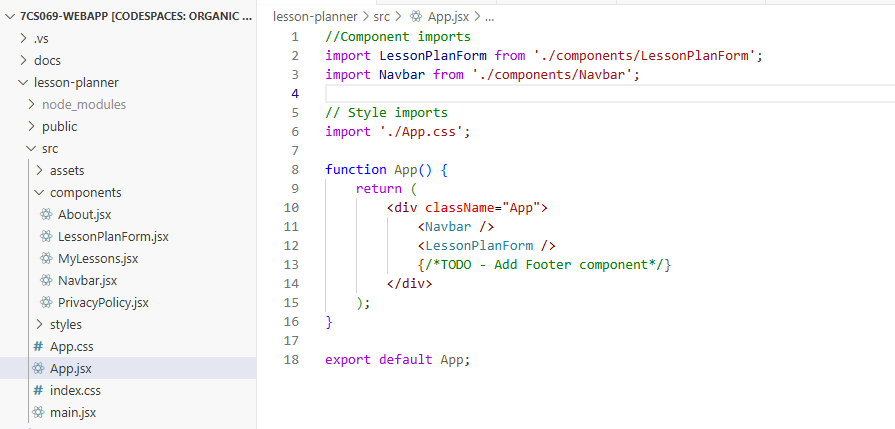

# 7CS069 WebApp

## Contents
1. [Project Overview](#1-project-overview)
    - [App Overview and Context](#app-overview-and-context)
    - [Tech Stack](#tech-stack)
2. [Features](#2-features)
3. [Development Process](#3-development-process)
    - [Planning](#planning)
    - [Setup](#setup)
    - [Backend](#backend)
    - [Frontend](#frontend)
    - [File Handling](#file-handling)
    - [UI and UX Polishing](#ui-and-ux-polishing)
    - [Testing](#testing)
    - [Performance](#performance)
    - [Wrap-up](#wrap-up)
4. [Resources Used](#4-resources-used)
    - [Tutorials and Practice](#tutorials-and-practice)
    - [Academic and Literary Sources](#academic-and-literary-sources)

## 1 Project Overview
### App Overview and Context
A project allowing educators to create and store lessons for easy access. Lesson files 
(PowerPoint, worksheets etc.) can be uploaded to download on any internet-connected 
device at a later date. Lessons can be linked to UK National Curriculum statements to 
keep track of coverage across a school year.

This project aims to reduce the workload of teachers by offering an easy-to-use and 
intuitive UI, with an end-goal of integrating a UI lesson generator into the app. 
Options will be given for teachers to use research-based lesson structures (such as 
the <a href="https://d2tic4wvo1iusb.cloudfront.net/eef-guidance-reports/metacognition/Seven_step_model_1.0.pdf">
EEF 7-step model</a>) to improve the efficiency whilst planning.

The full scope of this app can be found in the [scope document](docs/scope.md).

### Tech Stack
The app will use a mixture of frameworks across the full stack. For the frontend, React will be used along with Boostrap to structure the UI. The backend will be built using Laravel
 with MongoDB.

## 2 Features
* Lesson CRUD (Create, Read, Update, Delete)
* File attachments (upload, download, delete)
* Responsive layout (mobile -> desktop)
* Stretch Features: 
  * tags  
  * registration and Google logins
  * AI lesson builder

## 3 Development Process
### Planning
* Idea chosen
* initial entity design

#### User Stories
User stories were created to outline the application requirements from a user's perspective. They follow a common structure of: 
- User [__As a'__]
- Goal [__I want__]
- Benefit [__So that__] 
This structure makes it easier to define features of an app in a user-focused way. Each story also include **acceptance criteria**, which describes what a user must do (input) and the expected outcome (output).
By following the user stories, the requirements of the app are clearly testable and can be mapped directly into implementation steps to improve the efficiency and workflow. 
*[(GeeksForGeeks, 2025)](#references)*

##### Example User Story

### Setup
* Repo created
* Stack scaffolded (React and Laravel)

### Backend
* CRUD endpoints built
* Database migrations
* Tests

### Frontend
#### React components

The React frontend is organised into components, with each component stored in a separate file. This follows <a href="https://dev.to/algo_sync/how-to-structure-a-react-project-in-2025-clean-scalable-and-practical-15j6">best practice for React developers</a> to improve readability and reusability of the codebase.

The 'LessonPlanForm' component is defined as a separate component and imported into App.jsx so it can be rendered and displayed to the user.

* Forms
* Routing
* API integrations

### File handling
* Laravel storage
* Validation
* Upload testing

### UI and UX polishing
* Responsiveness
* Error states
* Accessibility

### Testing

### Performance
Baseline -> fixes -> improved results

### Wrap-up
* Final bug fixes
* README / Documentation finalised

## 4 Resources Used
* <a href="https://wireframe.cc/">wireframe.cc</a> to create webpage wireframes
* <a href="https://color.adobe.com/">Adobe</a> for color palette generation

### Tutorials and Practice
* React.dev Tic-Tac-Toe tutorial completed (2025.09.22)
  * https://github.com/I-DAnders-91/react.dev
* Lesson plan form (2025.09.27)
  * _Create a Complete Form using React JS | React Forms_ (<a href="https://www.youtube.com/watch?v=H63Pd_lXkeQ">YouTube</a>)
### References
GeeksforGeeks(2025) **How Do You Write a User Story?**. Available at: https://www.geeksforgeeks.org/software-engineering/how-do-you-write-a-user-story/#1-identify-the-user. Accessed: 28th Sept. 
